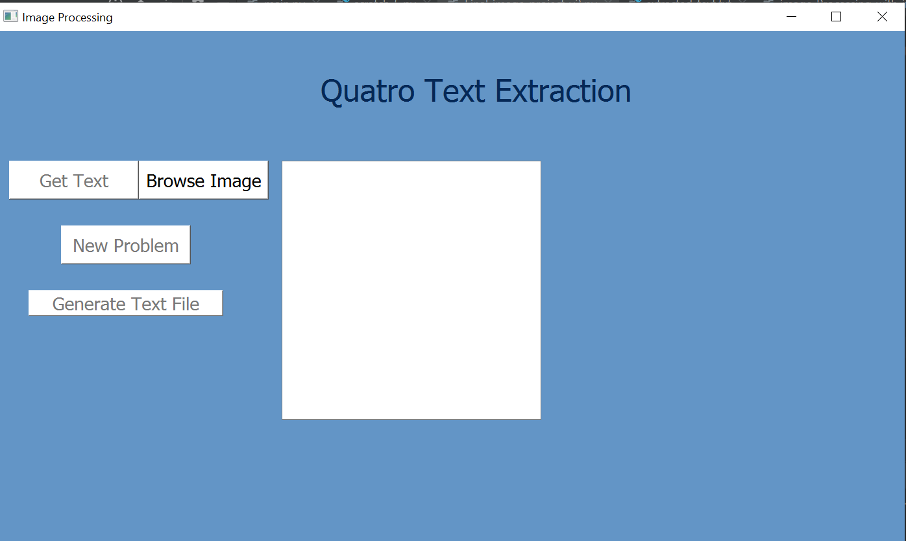
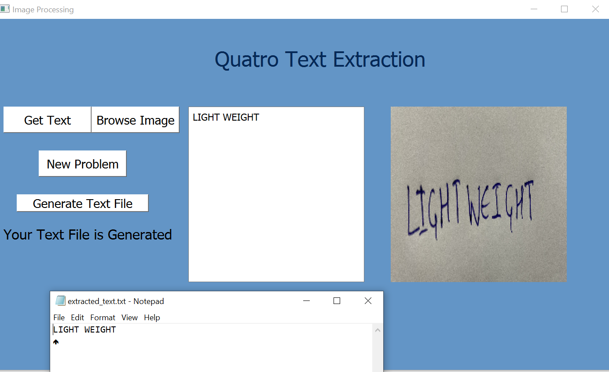
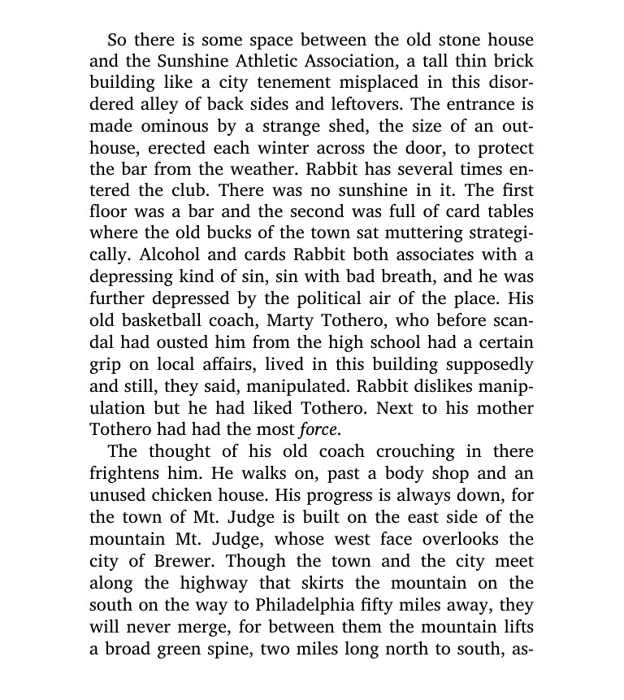
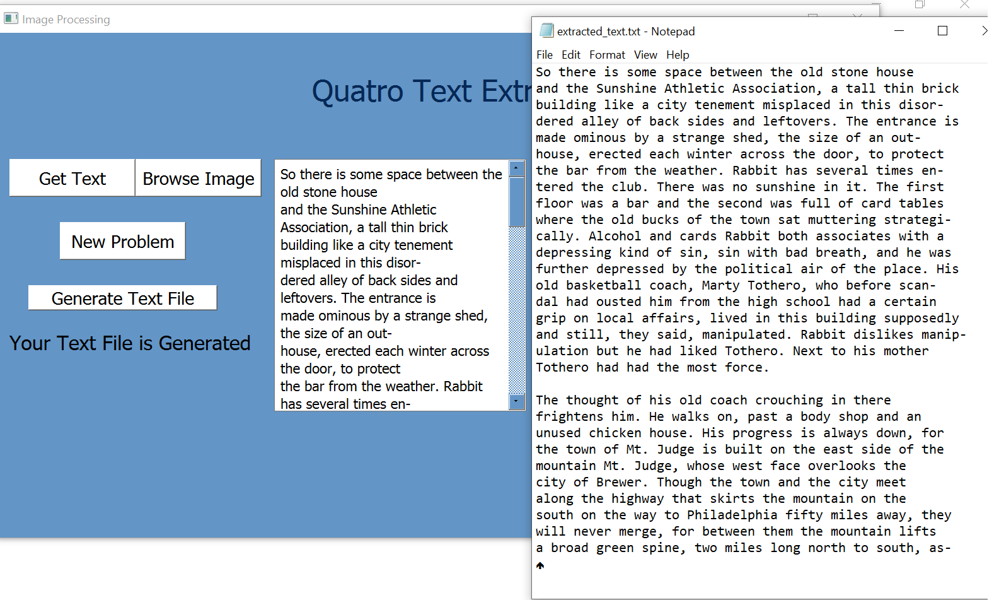

# Image_Processing_Quatro

Time flies fast, but it's good when you are the pilot.
Our Application is made to save your time.

The main target of the application is to recognize and extract the English characters from an image and write the extracted characters in a text file to be able to save it in an any other form (word, pdf, ...etc.)

we made a very simple interface that allows you to upload any image from your computer and just click on "Get Text" button, you'll find the text extracted from the image written in the line edit, and when you press "Generate Text File" button, you'll find a text file named "extracted_text" which includes the extracted text.

The Application is totally implemented in python

for the handwritten images we've reached an accuracy of 90-95% depending on the style of the handwriting

But for the hard copied computer typed images(Novels, references, ...etc.), we've reached an accuracy of 99-100%

The required to be scanned image is

and the output is:

Here is a video explaining our project in details and how it can recognize and extract text from images and save it to a textfile:https://www.youtube.com/watch?v=8wOUIgJDCcE

